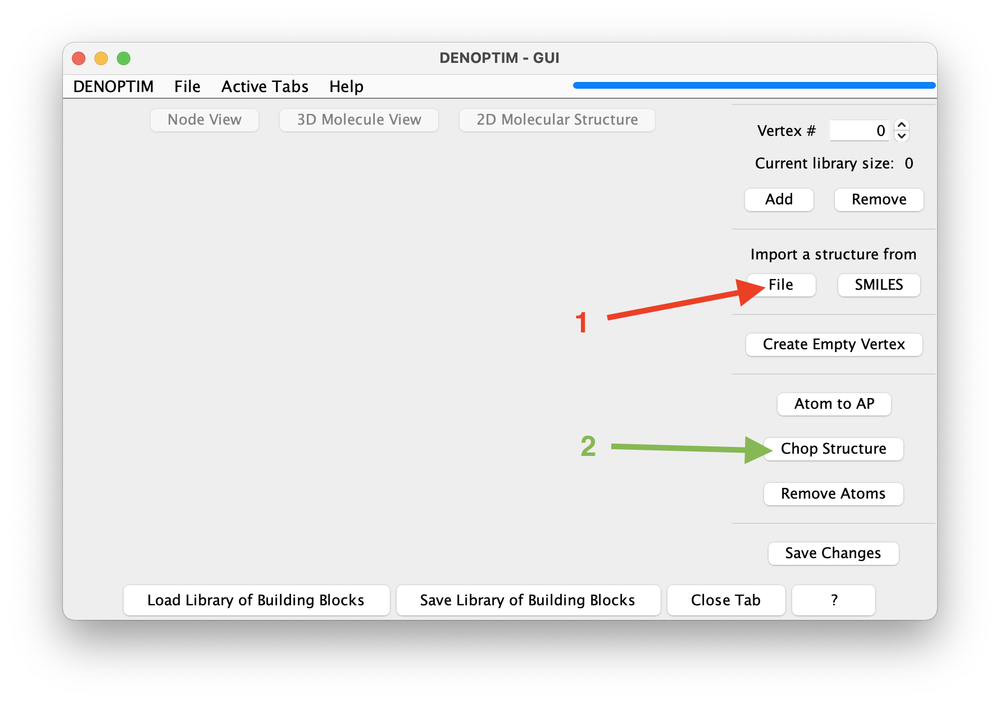
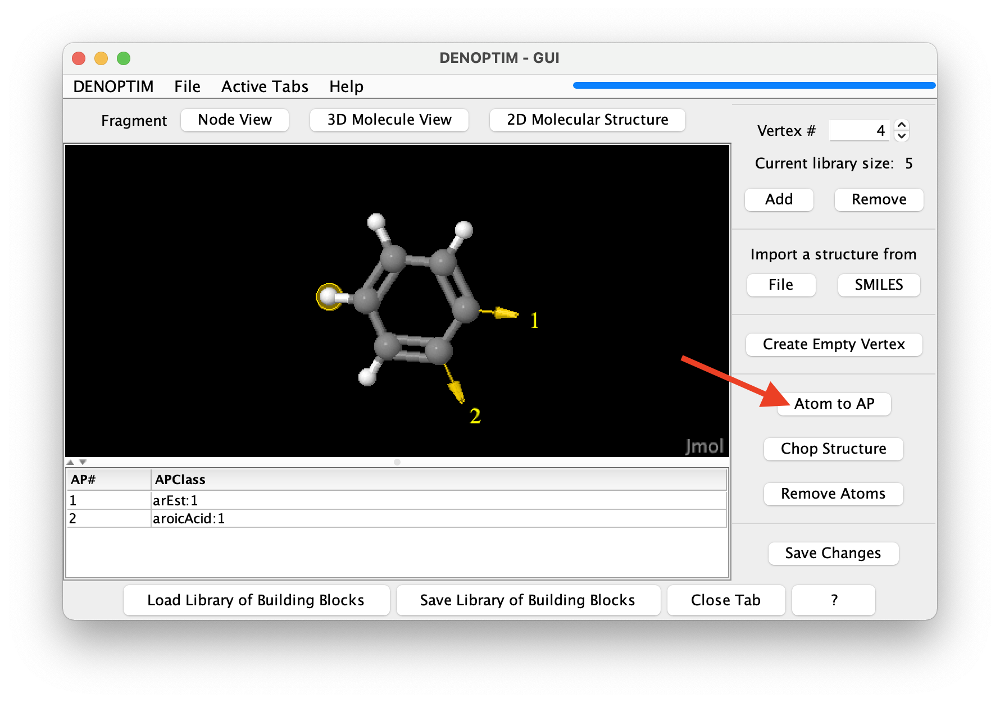

# Tutorial 1.0: Molecular Fragments
The fundamental concept in DENOPTIM's world is that chemical objects, such as molecules and materials, are made of building blocks that can be attached to form a **Graph**-like structure. Building blocks are, therefore, called **Vertices** or **Nodes** of the graph that defines a chemical object. The most intuitive type of building block or vertex is a **molecular fragment**. Molecular fragments can contain one or more atoms, bonds, and, as well as any other vertex, are decorated with **attachment points**. The latter collect the information defining how a fragment can be used to build molecules by attaching fragments to each other.

---
## Visualize Molecular Fragments

1. Open [DENOPTIM's GUI](../gui.md) and choose `File` -> `Open` then navigate to open the file `exercise_1.0/fragments-1.sdf` from the unzipped downloaded dataset. The same file can be opened directly in the command line by issuing the following command from within the folder created when unzipping the downloaded dataset:
	```
	denoptim exercise_1.0/fragments-1.sdf
	```
	The graphical interface will open a window and display the fragments contained in the file.

	

	**Figure 1**: The graphical representation of a molecular fragment. The red arrow indicates the spinner used to navigate the list of fragments.

2. Use the mouse to rotate the three-dimensional molecular representation of the fragment (click and drag).

	Molecular fragments can have any number of atoms and any number of attachment points (the yellow arrow in the three-dimensional representation), each of which defined the possibility to bind another building block. The attachment point is decorated by a string, i.e., the so-called **Attachment Point Class** (**APClass**), that is used to control how attachment points can be used to connect fragments. For clarity, the APClass is declared in the table below the three-dimensional representation of the fragment.

3. Use the spinner in the top-right part of the window (see in red arrow figure above) to navigate to the next fragments and backwards. Navigate to the third fragment.

	Fragments can also contain *pseudoatoms*/*dummy* atoms, as shown in the third fragment: a [cycplopentadienyl](https://en.wikipedia.org/wiki/Cyclopentadienyl) fragment that offers the possibility to host a substituent different from H on one of the carbon atoms. Note the *dummy* atom placed at the centroid of the ring: it is used to hold the attachment point that represents the capability to use such fragment to bind a meta in hapto-5 mode (&eta;<sup>5</sup>).

4. Click on the `Node View` button to show what each fragment represents in terms of graph building blocks.

	Each **molecular fragment** represents a single **vertex** that can be used as a building block for a graph. The chemical content, i.e., the number and identity of the atoms and bonds, is not relevant when perceiving molecular fragments as graph building blocks. Instead, what defines the characteristics of the vertex is the set of attachment points, each with its own APClass.

	

	**Figure 2**: The *Node View* representation of a vertex.

---
## Make Fragments in the GUI
1. We will now make new molecular fragments that we could use as building blocks. To exploit the existing chemical knowledge we will make such molecular fragments by *fragmenting* (a.k.a chopping up) a known compound. Click on `File` -> `New` -> `New Molecular Fragments` to open a new vertex inspector tab. Then click on the dedicated button to *Import a structure from* `File` (see red arrow in the figure below).

	

	**Figure 3**: Buttons used to import a structure from file (red arrow) and launch the fragmentation (green arrow).

2. Once the molecule is displayed, you can click on `Chop Structure` (see green arrow in the figure above) to start the automated generation of fragments. This will open a new window that offers the possibility to control the **cutting rule**, i.e., the rules defining how the structure should be cut (see below). Click on `Start fragmentation` to accept the defaults.

3. The result will be a set of 4 new fragments obtained by cutting the bonds marked by a star in the following figure. Once we confirm to import all of them, these fragments will be loaded in the current vertex inspector tab.

	

	**Figure 4**: Bonds identified by the default cutting rules and cut Buttons used to import a structure from file (red arrow) and launch the fragmentation (green arrow).

	The set of fragments and the APClass on the attachment points of the generated fragments are the result of the **cutting rules**. A single cutting rule is a substructure pattern that defines which bonds are broken by a specific cutting rule and what is the APClass of the resulting attachment points. Further details are available in the [dedicated documentation](https://htmlpreview.github.io/?https://github.com/denoptim-project/DENOPTIM/blob/master/doc/user_manual.html#Toc2222_2) and publication ([*J. Chem. Inf. Model.* **2014**, 54, 7, 1919–1931](https://doi.org/10.1021/ci5003153)). In brief, each cutting rule is expressed as a [SMARTS](https://www.daylight.com/dayhtml/doc/theory/theory.smarts.html) resulting by the combination of the components dedicated to the bond it self and the atoms connected by such bond. The cutting rule can be inspected in the dialog shown when clicking on the `Chop Structure` button.

4. Attachment points can also be generated manually. Select one or more terminal atoms by clicking on them, and click on the `Atom to AP` button (see red arrow in the figure) to transform one or more atom in attachment points. A dialog will allow to specify the APClass of the resulting attachment points.

	

	**Figure 5**: Selection of an atom to be converted into an attachment point by clicking on the button identified by the red arrow.

---
## Running the Fragmenter
Fragmentation of many structures is more efficiently performed by running DENOPTIM's Fragmenter from the command line. Moreover, the Fragmenter offers additional possibilities:
* apply filtering criteria to the structures to be fragmented,
* remove duplicate fragments,
* apply filtering criteria on generated fragments,
* identify the most representative conformations of a molecular fragment.

This tutorial will take structures from the [Crystallography Open Database](http://www.crystallography.net/cod/result.php) and chop them to generate and organise fragment automatically. In general, the source of the geometries can be any crystallography database, or any database of computed structures.
In this specific example, out goal is to collect fragments of chelated Ru-alkilydene complexes, which might be used to design Ru catalyst for [olefin metathesis](https://en.wikipedia.org/wiki/Olefin_metathesis).

1. Collect the structures from which to generate fragments. For this exercise the structures are already collected in file `exercise_1.0/structures_from_COD.cif` from the [downloaded dataset](header-dataset).

	The structures used here can be obtained from the [Crystallography Open Database](http://www.crystallography.net/cod/index.php):  [4064102](http://www.crystallography.net/cod/4064102.html), [4064965](http://www.crystallography.net/cod/4064965.html), [4064964](http://www.crystallography.net/cod/4064964.html), [4064967](http://www.crystallography.net/cod/4064967.html), [4068123](http://www.crystallography.net/cod/4068123.html), [4068964](http://www.crystallography.net/cod/4068964.html), [4068965](http://www.crystallography.net/cod/4068965.html), [4068966](http://www.crystallography.net/cod/4068966.html), [4075179](http://www.crystallography.net/cod/4075179.html), [4075180](http://www.crystallography.net/cod/4075180.html), [4110988](http://www.crystallography.net/cod/4110988.html), [1504708](http://www.crystallography.net/cod/1504708.html), [1504709](http://www.crystallography.net/cod/1504709.html), and [4064690](http://www.crystallography.net/cod/4064690.html).

2. The settings of the Framenter are collected in an input file prepared according to the [user manual](https://htmlpreview.github.io/?https://github.com/denoptim-project/DENOPTIM/blob/master/doc/user_manual.html#Toc2222_1). An example of such file is available as `exercise_1.0/fragmentation.params`. The content is the following:
	```text
	FRG-StructuresFile=structures_from_COD.cif
	FRG-CuttingRulesFile=cutting_rules
	FRG-RetainSMARTS=[Ru]
	FRG-RejectSMARTS=[#6]~[Ru]~[#6]
	FRG-IsomorphicSampleSize=20
	FRG-ClusterizeAndCollect=centroids
	```
	In this specific case, we ask the Fragmenter to chop the structures found in file `structures_from_COD.cif` using the cutting rules available in file `cutting_rules`. In addition, we ask to keep only fragments that contains at least one ruthenium atom (line 3 in the example above) while not containing any chain of atoms matching the carbon-(any bond)-ruthenium-(any bond)-carbon patterns (line 4 in the example above). These constrains reflect the desire to collect only Ru-containing fragments that do not contain partially fragmented systems, which would contain more than one organometallic bond to Ru.
	Line 5 and 6 control the identification of the most representative fragments. Namely, fragments are to be collected in samples of isomorphic fragments (i.e., fragments with the same graph structure of atoms and attachment points, but not necessarily the same geometry. Effectively, isomorphic fragments have the same constitution of atoms and attachment points, but potentially different stereochemistry) counting up to 20 fragments (line 5). For each such sample of isomorphic fragments, the Fragmenter will then run a clustering analysis based on the RMSD of atomic positions upon frozen-geometry superposition to discriminate isomorphic fragments with different geometry and will return the centroid of each such cluster as the most representative fragment of the cluster (line 6).

3. Run the fragmentation from within the `exercise_1.0` folder using this command:
	```
	denoptim -r FRG fragmentation.params
	```

4. A new folder will be created with name <code>FRG<i>YYYYMMDDHHMMSS</i></code> where <code><i>YYYYMMDDHHMMSS</i></code> is the time stamp. Log files tracking the workings of the process, and files collecting intermediate data are contained in this folder. In particular, the final collection of the most representative fragments, i.e., the centroid of each cluster of isomorphic fragments, is saved in file `FRGYYYYMMDDHHMMSS/Fragments.sdf`. It is convenient to open such file in the graphical user interface to inspect the results (**NB:** replace </i>YYYYMMDDHHMMSS</i> with the appropriate values):
	```
	denoptim FRGYYYYMMDDHHMMS/Fragments.sdf
	```

	Note that the fragment corresponding to the chelating *ortho*-alkoxybenzylidene (Figure 6) is the centroid of a cluster collecting a handful of isomorphic and geometrically similar fragments. This information can be found in the `ConformerExtractorTask-\*_IsomorphicFamily_\*.log` files. The centroid is calculated averaging all atomic positions, thus the noise due to small distortions in the geometries is attenuated.

	

	**Figure 6**: Fragment obtained as the cluster centroid for *ortho*-alkoxybenzylidene-chelated ruthenium centers. The atom in magenta is a dummy atom added by DENOPTIM to facilitate the manipulation of linearities around the metal center.

	Moreover, note that the isomorphic but geometrically diverse fragments in Figure 7 are collected separately as they belong to two different geometry clusters of the same sample of isomorphic fragments.

	

	**Figure 7**: isomorphic but geometrycally different fragments, i.e., these fragments have the same constitution but different configuration at the Ru center: *trans* for the fragment on the left, *cis* for that on the right. The atom in magenta is a dummy atom added by DENOPTIM to facilitate the manipulation of linearities around the metal center.


# Exercise 1.2: Building Transition Metal Complexes from Fragments

In this exercise we familiarise with the use of molecular fragments, attachment points, and connection rules. The goal is to build a small space of building blocks, also known as a "fragment space", from scratch.

> **NOTE** This exercise is best performed while having access to the Internet. In fact, DENOPTIM will call for an online service that converts SMILES to 3D-structures. When off-line, it will offer the user with the choice to use a local functionality from [CDK](https://cdk.github.io/), which is OK but slower and less accurate.


## Create a Space of Building Blocks (Fragment Space)

1. Open the Graphical User Interface (GUI) by running `denoptim` from within the `dnp_workshop` environment.
2. Chose `Make Fragments` from the list of shortcuts, or `File` -> `New` -> `New Molecular Fragments`.
3. Using the button under *Import a structure from `File`*, load the structure of each of the Pt complex files stored in this folder.
4. Click on atoms to select them (see the note below for a hint on how to select atoms) and then `Remove Atoms` to remove them and isolate the molecular fragment you are interested in, or `Atom to AP` to replace a single-connected atom with an attachment point.
5. Repeat steps 3 and 4 as much as needed to generate the following fragments:
	- Iodine (X-ligand) with one attachment point (AP) with APClass `Xlig:1`
	- NO<sub>2</sub> (X-ligand) with APClass `Xlig:1`
	- P(Ph)<sub>3</sub> (L-ligand) with one APClass `MPhosphine:1`
	- Pyridine (L-ligand) with APClass `MPy:1`
	- the five-atom ring of imidazolylidene (a N-heterocyclic carbene, or NHC, fragment) with one AP with class `MImidazolylidene:1` and two APs with class `ImidazolylideneSubN:0` each replacing one of the substituents on the N atoms.
6. We now create some organic fragments to populate the N-substituents on the NHC fragment. Since NHCs can often be synthesised starting from amines (see [*Chem. Rev.* **2011**, 111, 4, 2705–2733](https://doi.org/10.1021/cr100328e), you can generate the structure of an amine by clicking on *Import structure from `SMILES`* and type a [SMILES string](https://www.daylight.com/dayhtml/doc/theory/theory.smiles.html). For example, generate these amines and converted them to fragments by replacing the N atom with an attachment point of class `ImidazolylideneSubN:1`:
	- `CN`
	- `c1(C)ccccc1N`
	- `C1CCCCC1N`
7. Save this small library of fragments to an SDF file, call it `my_library_of_fragments.sdf` under the `exercise_1.2` folder.
8. We now create the compatibility rules for assembling Pt complexes by combining molecular building blocks. In DENOPTIM, click `File`->`New`->`New Compatibility Matrix`
9. `Import APClasses` by loading first the `Pt-CO_fragment.sdf` file and then the ´my_library_of_fragments.sdf´. In both cases, choose ´Scaffolds and Fragments´ when asked about the type of building block.
10. Then `Add Compatibility Rule` between `Llig:0` and all the APClasses that represent the capability to coordinate a metal as a L-ligand, namely `MPy:1`, `MPhosphine:1`, and `MImidazolylidene:1`. Hold the `command`/`CTRL` key to select multiple entries. Note that the two lists refers to different role of the attachment point: *growing graph*, and *incoming fragment*.
11. Add the compatibility rule between `Xlig:0` and `Xlig:1`
12. Add the compatibility rule between `ImidazolylideneSubN:0` and `ImidazolylideneSubN:1`
13. We now define the rules to saturate open valences. Import the APClasses from `H_and_Me.sdf`, move to the `Capping Rules` tab, and `Add Capping Rule` to `ImidazolylideneSubN:0` with `hyd:1`
14. Last, we define what attachment points cannot stay unused, but have no capping group. Move to the `Forbidden Ends` tab and `Add Forbidden End Rule` to `Llig:0`  and `Xlig:0`.
15. Save the compatibility matrix as `my_compatibility_matrix.par` under the `exercise_1.2` folder.

> **NOTE** Right-click on the molecular viewer to get the vast functionality offered by [Jmol](http://jmol.sourceforge.net/), including, for instance, see the `Select` -> `Invert Selection`. In particular, in the right-click menu you can chose `Console` to open Jmol's command line interface and use the `select` command. Here are some common examples of use:
> - `select _N`: selects all nitrogen atoms.
> - `select atomno >= 10 and atomno <= 43`: selects atoms from number 10 to 43 in the list of atom. Note the use of a the logical operator `and`.
> - `select search("<SMARTS>")` where `<SMARTS>` is a [SMARTS substructure search query](https://www.daylight.com/dayhtml/doc/theory/theory.smarts.html). For example,
>	- `select search("[#7]-[#6]")`: selects all nitrogen and carbon atoms of any kind that are connected by a single bond.
	- `select search("[r5]")`: selects all atoms that are part of a five-member ring.
> - `select selected OR connected(selected)`: propagates selection to all atoms connected to currently selected atoms.
> - `select none`: clears the list of selected atoms.
> Refer to [Jmol's documentation](https://chemapps.stolaf.edu/jmol/docs/) for further details on the functionality provided by Jmol.

## Explore the fragment space
Here we will briefly use the fragment space to generate all the Pt complexes that are encoded in the space we have just generated.
1. Click on `File`->`New`->`New Virtual Screening`.
2. In the windows for the configuration of the run, under the `Space of Building Blocks` tab browse to specify:
- `Pt-CO_fragment.sdf` for the *Scaffold fragments library *
- `my_library_of_fragments.sdf` for the *Fragments library*
- `H_and_Me.sdf` for the *Capping groups library*
- `my_compatibility_matrix.par` for the *Compatibility matrix file*
- since we have heavy atoms, we need to specify 1000 for the maximum molecular weight.
3. For having a way to sort the generated Pt complexes we make DENOPTIM calculate the molecular weight. Switch to the `Fitness Provider` tab and type `MW` in the text box defining the equation of the fitness.
4. Click on `Run Now...` and confirm you want to run the experiment. A dialog will tell you where the results will be places: remember that name.
5. For a short moment the bar on the top-right part of the DENOPTIM window, which was originally blue, will turns grey to indicate that all the submitted tasks are still running. Then it will turn blue to indicate that the run is completed.
6. `File`->`Open Recent` to select the results and open them.

## Discussion
- How to define a fragment space that for Pt complexes where the properties of the metal center can vary with the largest range?
- Conversely, how to design a fragment space that allows to achieve the finest resolution when mapping the properties of the Pt complex?
- Reflect over strategies to design fragment spaces for exploring properties of a central transition metal (e.g., the effective electron density on the metal) vs exploring inter-molecular interaction properties (e.g., interaction of the transition metal complex with the surrounding environment, like with solvent and surfaces).

## Go Beyond Classical Chemistry
DENOPTIM can handle any arrangement of atoms and pseudo-atoms. Have  look in the `exercise_1.2/examples_with_Du` for examples where dummy atoms are used to represent multi-hapto metal-ligand bonding.

Although you can open these file via the GUI, we use this opportunity to use the command line interface for opening files with DENOPTIM. Try:
```
denoptim examples_with_Du/MOL000006.sdf
```
