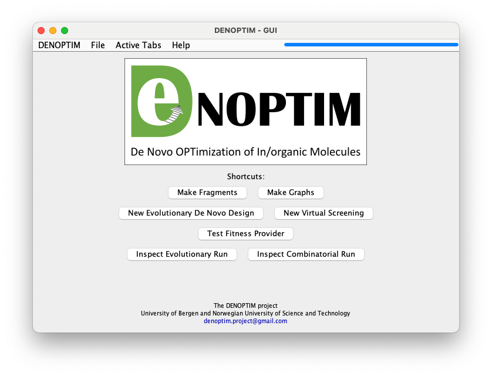
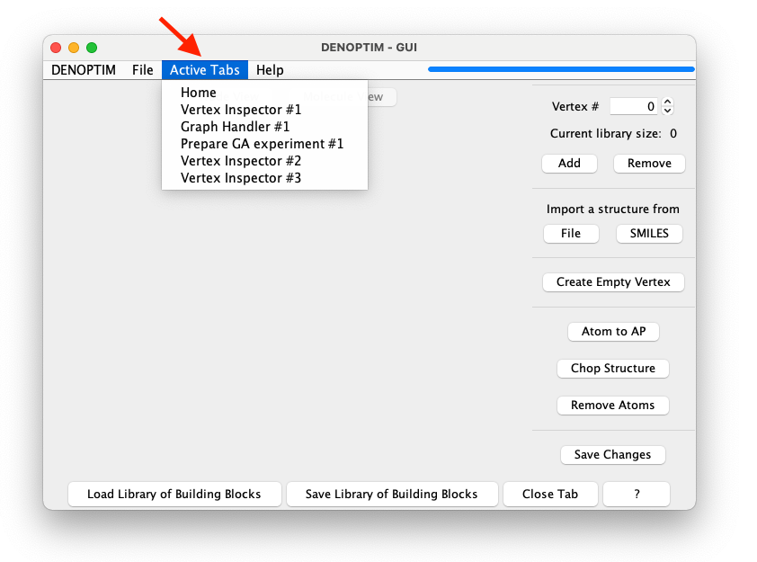

# The Graphical User Interface (GUI)
DENOPTIM comes with a graphical user interface that offers a way to interact with DENOPTIM's functionality (execute complex operations with few clicks), visually inspect the objects that DENOPTIM uses to represent chemical objects (i.e., vertexes, graphs) and the outcome from combinatorial and evolutionary experiments.

(header-gui)=
## Launch the GUI
The most convenient way to launch the GUI is running the `denoptim` command in the command line interface:
```
denoptim
```
Note the absence of any argument. This command launches the GUI and open its home tab (Figure 1). The shell where the command has been issued will be used for logging while the GUI is running.

<div style="background-color: #e7f3fe; border-left: 6px solid #2196F3; margin-bottom: 15px; padding: 4px 12px;">
<b>INFO:</b> The <code>denoptim</code> command is nothing more than an alias to the command creating a JAVA virtual machine that runs the main method in the archive of DENOPTIM classes: <code>java -jar  $PATHTOJAR/denoptim-$VERSION-jar-with-dependencies.jar</code> where <code>$PATHTOJAR</code> is the path where DENOPTIM has been installed and <code>$VERSION</code> is the version numbers (e.g., 3.2.0). These variables are set by the installation process by Conda.</div>



**Figure 1**: The home tab of the GUI.

## What's in the GUI
The GUI has a menubar with standard functionality:
* the `DENOPTIM` menu, which access to general settings and information and button for exiting the GUI,
* and the `File` menu, which can be used to open existing files or create new files.
Note that the home tab offers a few handy shortcuts to perform the same actions. For example, clicking on `Make Fragments` is the same as `File` -> `Open` -> `New Molecular Fragments`.

Any operation such as opening a file, creating a new file, or preparing a new experiment will open a new panel (or tab), that is a new window design dedicated to the specific task. A newly opened tab is displayed in the main DENOPTIM window replacing the home tab. Notably, any tab opened in the GUI remain still accessible even after other tabs have been created and have replaced the original tabs in the main window. The main window is like a deck of cards with only one card on the top: it *displays only one active tab at the time*. To navigate such deck of cards, for example to reopen the home tab after having opened another tab, one can use the menu called `Active Tabs`. This menu contains the list of the independent tabs that are currently open in the GUI (Figure 2). Tabs remain open until they are closed by the user using the dedicated `Close Tab` button present in all kinds of tab but the home tab (i.e., the home tab cannot be closed).



**Figure 2**: The list of active tabs is available when clicking on the `Active Tab` menu (see red arrow). It allows to access any open tab. In this case the list contains a few active tabs. Note that tabs of the same kind such as the Vertex Inspector ones are assigned an index to distinguish them from each other.

## Open Files in the GUI
Besides the natural `File` -> `Open` sequence, one can open files in the GUI directly from the command line using a command like this:
```
denoptim file_to_open
```
This command will open the `file_to_open` using the most appropriate kind of tab. For instance, a Vertex Inspector tab will be used if the `file_to_open` is a file containing vertexes. Conversely, if `file_to_open` is a folder containing an evolutionary experiment (see the Note box below) the tab used to open the file will be a GA Run Inspector (Genetic Algorithm Run Inspector).

Note that multiple files can be opened with one command. The GUI will use an appropriate tab for each file, thus the list of active tabs can easily become long.
```
denoptim file_A file_B file_C ...
```

<div style="background-color: #e7f3fe; border-left: 6px solid #2196F3; margin-bottom: 15px; padding: 4px 12px;">
<b>NOTE:</b> The result of a complex experiments like a combinatorial exploration or an evolutionary design are collected under a single folder that is specific to that experiment (i.e., the parent folder of that experiment) and that usually contains many files and subfolders. DENOPTIM's GUI offers the possibility to select a parent folder and open digest its content as a whole entity, thus producing an easy to visualise overview of the results collected in the folder. Dedicated tutorial will show this with examples.</div>
