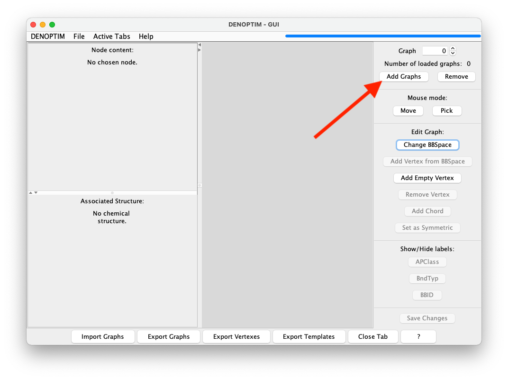

# Tutorial 1.1: Graph Representation
DENOPTIM uses graphs to represent items such as chemical objects. Graphs are collections of vertices and edges. Vertices represent each one of the building blocks of the graph. Edges represent the relation between the building blocks. The [previous tutorial](header-tutorial-fragments) has already presented the most intuitive type of building block for molecular design, i.e., the molecular fragments. Here, we'll see how these building blocks can be combined to define complete chemical objects.

---
(header-look-at-graphs)=
## Visualize a DENOPTIM Graph

Open [DENOPTIM's GUI](header-gui) and choose `File` -> `Open` then navigate to open the file `tutorial_1.1/graph_for_Pt_complex.sdf` from the unzipped [downloaded dataset](header-dataset). In alternative, open the file with this command from the root folder of the downloaded dataset.
```
denoptim tutorial_1.1/graph_for_Pt_complex.sdf
```
The graphical interface will open a window and display the graph representation contained in the file. The DENOPTIM graph representations do not have any dimensional structure (no 2D or 3D coordinates), though they can still represent 3D molecular models (see Figure 1, and note the different dimensionality between the right-hand, which depicts DENOPTIM's graph, and bottom-left panel, which depicts the corresponding molecular model). The vertices in the right-hand panel can be moved with the mouse or by right-click -> `Refine node location`.

<div style="background-color: #e7f3fe; border-left: 6px solid #2196F3; margin-bottom: 15px; padding: 4px 12px;"><b>NOTE:</b> Since graphs have no dimension, the relative placement of the vertices in the necessarily bi-dimensional graphical representation changes every time such generation is created. For example, opening the same file multiple times will result in multiple bi-dimensional depictions.</div>


**Figure 1**: The graph representation of a transition metal complex. The viewer depicts the DENOPTIM graph representation on the right-hand panel, and the three-dimensional molecular model in the lower part of the left panel. The upper part of the left panel shows the content of the vertex currently selected in the right-hand panel (vertex with label *16*, and which is highlighted in light green).

The colour of the vertices in the DENOPTIM graph viewer encode information on the roles of each vertex:
* blue vertices have no special role. These are standard building blocks.
* red vertices have **Scaffold** role. Scaffolds have been declared to contain the single most critical component of the chemical entity (e.g., the metal center in a transition metal complex) and are, therefore, used as starting point when constructing new entities of a certain kind (e.g., Pt complexes).
* green vertices are **Capping group**. These are vertices that by contract saturate open valences and open coordination sites. Capping groups are most often hydrogen atoms, but can be anything and in the loaded graph they are Ph groups.
* bright green is used to identify any selected vertex. Vertices can be selected by clicking on them (thus triggering the generation of a molecular representation of the vertex content) or by drawing a selection rectangle with the mouse (thus selecting more than one vertex).
* orange (not shown in Figure 1) for vertices used to form cyclic graphs (Ring-Closing Vertices, described [later](RCVs)).

(header-build-graph)=
## Convert standard molecular representations to DENOPTIM Graphs
Standard molecular representation such as SDF and SMILES can be converted to DENOPTIM graphs by performning an on-the-fly fragmentation that identifies the molecular building blocks and convertes them into graph vertices. To this end, 
1. Open the graph handler by `File` -> `New` -> `New Graphs`
2. Select `Add Graphs` -> `Convert` and navigate to a file (SDF or SMILES) containign one or more molecules to be converted into DENOPTIM graphs. For this tutorial, navigate to file `tutorial_1.0/aspirin.sdf`.

	

	**Figure 2**: Sequence of buttons to click to convert a molecule into a DENOPTIM graph.

4. A dialog will appear allowing to control the fragmentation settings and cutting rules, but we accept the defaults and click on `Start Fragmentation`.
5. The graph resulting by fragmentation of the aspirin molecule and re-assembling of the fragment is now displayed in the graph handler. The resulting graphs can be saved with `Export Graphs`. Moreover, also the fragments generated by during the fragmentation can be exported independently on the graph. To this end use `Export Vertexes`.

(header-build-graph)=
## Build a DENOPTIM Graph
To build a graph that represents a chemical object like the one seen above, we need to give DENOPTIM two types of information:
* what building blocks can be used, and
* what are the rules that control how building blocks are put together.
The combination of these two ingredients is a **Fragment Space** (See [*J. Chem. Inf. Model.* **2014**, 54, 7, 1919–1931](https://doi.org/10.1021/ci5003153) for details), or, when building blocks can be more than just molecular fragments, we call it **Building Blocks Space** (BBSpace).

In practice, to build graphs by hand in the GUI:
1. Start the creation of a graph by clicking on `File` -> `New` -> `New Graphs`
2. Import a pre-configured space of building blocks by clicking on `Load BBSpace`.

	

	**Figure 3**: Graph viewer panel. The red arrow indicates the button to click to import a space of building blocks.

3. In the resulting window, define the four components highlighted in Figure 4. Use the `Browse` button on the right-hand part of each component's line to navigate the file system and select the following files from the unzipped [downloaded dataset](header-dataset):
	* `tutorial_1.1/lib_scaffolds.sdf` as library of vertices with Scaffold role,
	* `tutorial_1.1/lib_fragments.sdf` as library of vertices with no specific role,
	* `tutorial_1.1/lib_capping-groups.sdf` as the library of vertices with role of Capping Group,
	* `tutorial_1.1/compatibility_matrix.par` as the file with the compatibility matrix. This files contains the rules that control how building blocks are put together.
	The rest of the parameters can be ignored in this tutorial.

	

	**Figure 4**: Compiled form defining the space of building blocks (i.e., the fragment space) used in this tutorial.

4. Click on `Create BBSpace` (see red arrow in Figure 4) to terminate the definition of the space of building blocks and load it into the memory for further use. Note that the `Load BBSpace` button becomes `Change BBSpace` indicating that a BBSpace is already loaded.

5. Start the actual creation of a new graph item by clicking on the `Add` button (see red allow in Figure 5), and specify the desire to `Build` a graph (in the first step), and the to build it from `Scaffold` (in the second step).

	

	**Figure 5**: Button used to add a new graph into the current list of graphs.

6. The vertex selection window (see Figure 6) allows to chose which vertex to use, though in this library there is only one scaffold. Click on `Select current vertex` to confirm the choice.


**Figure 6**: The vertex selection window.

7. The Pt-containing vertex is then added to the growing graph which is represented in the graph viewer. The yellow circles represent available attachment points. Clock on the square representing the only verted that is now present in the graph, and do right click -> `Show APClasses` to display labels that define the class of each attachment point. The same result can be achieved by selecting the vertex and clicking on the `APClass` button on the right-hand panel.

8. Select the two attachment points with APClass <code>Xlig:0</code> by doing a single click one of them and then ALT+click on the second (or by drawing a selection rectangle that includes both). Then click on `Add Vertex from BB Space` (see Figure 7) and choose `Compatible Vertices`. This asks DENOPTIM to use the attachment point compatibility rules to restrict the choice of vertices to those that can offer at least one attachment point compatible with those selected in the graph.

<div style="background-color: #e7f3fe; border-left: 6px solid #2196F3; margin-bottom: 15px; padding: 4px 12px;"><b>NOTE:</b> the number of compatible vertices is stated in the `Compatible Vertices` button. Note if the selection of attachment points includes one with APClass <code>Xlig:0</code> and one with <code>scaff:0</code>, the list of compatible vertices is empty. This because the two APClasses are meant for different kinds of bonding interactions, namely the first is meant for a covalent ligand, while the second is meant to a dative ligand. In the current BBSpace there is no building block that can satisfy both requirements simultaneously.</div>


**Figure 7**: Sequence of clicks used to append compatible vertices on two selected attachment points simultaneously.

9. A new vertex selection window allows to choose among the four compatible vertices. Pick one of your choice. Note that all these four vertices have only one attachment point, which is pre-selected as its the only possible choice. If there were more compatible attachment points on the incoming vertex, then the user is asked to chose one. This is the attachment point the software will use to form an edge with the growing graph.

<div style="background-color: #e7f3fe; border-left: 6px solid #2196F3; margin-bottom: 15px; padding: 4px 12px;"><b>NOTE:</b> The creation of an edge between vertices does not necessarily correspond to the creation of a bond between atoms. APClasses can be used to define non-bonding edges that will not be converted into bonds upon generation of a chemical representation of the item defined by the DENOPTIM graph.</div>

10. Select another attachment point in the growing graph, and click on `Add Vertex from BB Space` to append more vertices according to your preference.

11. At any point you can click on `Save Changes` to trigger the conversion of the graph into a molecular representation that is displayed in the lower part of the left-hand side of the graph viewer panel. Note that such panel may have been reduced to minimal size to liberate space. In this case use move the panel divider with the mouse to adjust the size to your preference (See Figure 8).


**Figure 8**: Panel dividers (here highlighted by the red rectangles) and the their small, triangular buttons (pointed to by the arrows) can be used to resize the subpanels according to needs.


<div style="background-color: #e7f3fe; border-left: 6px solid #2196F3; margin-bottom: 15px; padding: 4px 12px;"><b>NOTE:</b> This tutorial shown how to build a graph manually. The process is similar to what occurs during automated construction of graphs with the difference that any decision taken by the used in this manual procedure is taken by the computed according to a probabilities that can be controlled by input parameters.</div>
