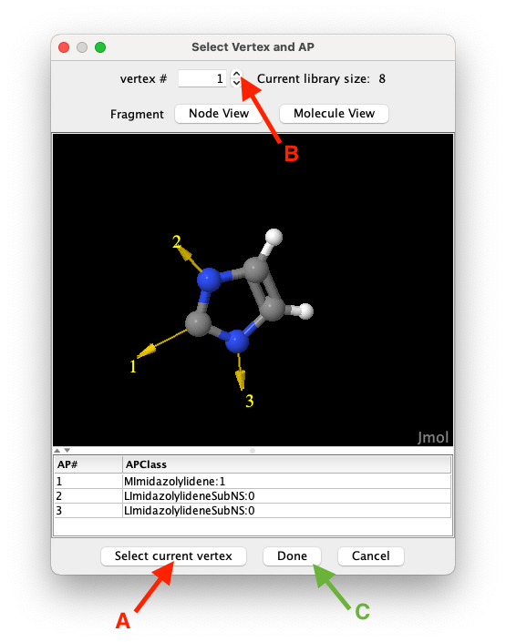
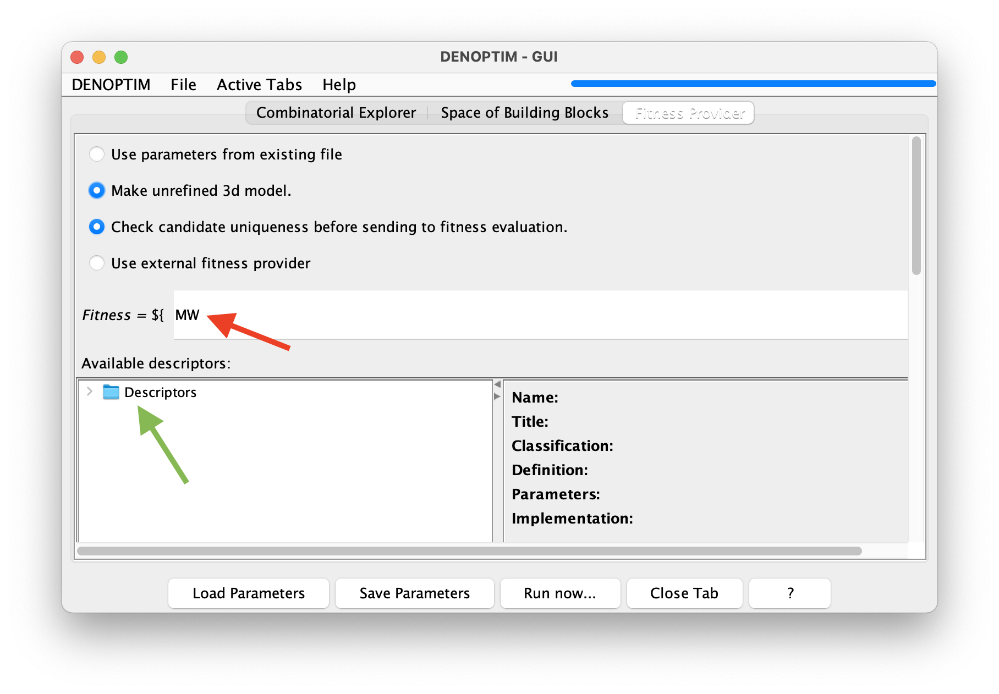

# Tutorial 1.2: Building Transition Metal Complexes from Fragments

This tutorial is about creating a small space of building blocks from scratch.

<b>NOTE:</b>This tutorial is best performed while having access to the Internet. DENOPTIM will call for an online service that converts SMILES to 3D-structures. When off-line, DENOPTIM will offer the user with the choice to use an off-line functionality from <a href="https://cdk.github.io/">CDK</a>, which is OK but slower and less accurate.

## Create a Space of Building Blocks (Fragment Space)

1. Open the Graphical User Interface (GUI) by running the `denoptim` command.

2. Chose `Make Fragments` from the list of shortcuts, or `File` -> `New` -> `New Molecular Fragments`.

3. Using the button under *Import a structure from `File`*, load the structures from `tutorial_1.2/Pt_complexes-1.sdf` and `tutorial_1.2/Pt_complexes-1.sdf`.

4. To generate building blocks, click on `Chop Structure` for each of the two Pt complexes. When asked, chose to keep only selected fragments (see Figure 1). Namely, keep only one fragment for each of these:
- Iodine (X-ligand) with one attachment point,
- NO2 (X-ligand) with one attachment point,
- Pyridine (L-ligand) with one attachment point,
- the Phosphorous atom (L-ligand) with four attachment points,
- the phenyl with one attachment point (i.e., substituent on P),
- the five-atom ring of imidazolylidene (a N-heterocyclic carbene, or NHC, fragment) with one attachment points (see figure 1).

	

	**Figure 1**: To select a vertex to import click on the `Select current vertex` button (A), use the spinner (B) to navigate the list of candidates, and click `Done` to close the vertex selection window confirming your selection.

5. Remove the two un-fragmented structures that were imported from file. Use the `Remove` button from the top-right part of the panel. After removing these structures, the `Current library size` should be 6, as only one item for each of the fragments listed in point 4 has been kept.

6. To increase the structural variability of the N-substituents on the NHC fragment, we add more fragments by hand. Since NHCs can often be synthesised starting from amines (see [*Chem. Rev.* **2011**, 111, 4, 2705–2733](https://doi.org/10.1021/cr100328e), we create simple amines and convert them into fragments suitable to become N-substituents on the NHC. To this end, generate the structure of each of the following amine by clicking on *Import structure from `SMILES`* and type one of the following [SMILES string](https://www.daylight.com/dayhtml/doc/theory/theory.smiles.html):
	- `CN`
	- `c1(C)ccccc1N`
	- `C1CCCCC1N`
	For each of these, select the hydrogen atoms bonded to N (see Note below for useful atom selection tricks) and delete them by clicking on the `Remove atoms`. Then select the N atom and click `Atom to AP` to replace the N atom with an attachment point of class `LImidazolylideneSubNS:1`.

	
<b>NOTE:</b>Right-click on the molecular viewer to get the vast functionality offered by <a href="http://jmol.sourceforge.net/">Jmol</a>, including, for instance, see the <code>Select</code> -&gt; <code>Invert Selection</code>. In particular, in the right-click menu you can chose <code>Console</code> to open Jmol's command line interface and use the <code>select</code> command. Here are some common examples of use:
	<ul>
	<li><code>select _N</code>: selects all nitrogen atoms.</li>
	<li><code>select atomno >= 10 and atomno <= 43</code>: selects atoms from number 10 to 43 in the list of atom. Note the use of a the logical operator <code>and</code>.</li>
	<li><code>select search("&lt;SMARTS&gt;")</code> where <code>&lt;SMARTS&gt;</code> is a <a href="https://www.daylight.com/dayhtml/doc/theory/theory.smarts.html">SMARTS pattern</a>. For example,
	<ul>
		<li><code>select search("[#7]-[#6]")</code>: selects all nitrogen and carbon atoms of any kind that are connected by a single bond.</li>
		<li><code>select search("[r5]")</code>: selects all atoms that are part of a five-member ring.</li>
	 	<li><code>select selected OR connected(selected)</code>: propagates selection to all atoms connected to currently selected atoms.</li>
	 	<li><code>select none</code>: clears the list of selected atoms.</li>
	</ul></ul>
	Refer to <a href="https://chemapps.stolaf.edu/jmol/docs/">Jmol's documentation</a> for further details on the functionality provided by Jmol.
	

7. With the `Save Library of Building Blocks` button, save the resulting library of 9 building blocks to an SDF file, call it `my_library_of_fragments.sdf` under the `tutorial_1.2` folder.

8. As pointed out in the [previous tutorial](header-build-graph), to use a space of building blocks we need to define the rules that control how the building blocks are attached to each other. To this end, we now define the set of compatibility rules for assembling Pt complexes by combining molecular building blocks. In DENOPTIM, click `File`->`New`->`New Compatibility Matrix`

9. `Import APClasses` by loading first the `Pt-CO_fragment.sdf` file and then the `my_library_of_fragments.sdf`. In both cases, choose `Scaffolds and Fragments` when asked about the type of building block. As we are just importing APClasses, no reaction is visible in the GUI upon confirming the type of building block.

10. Then `Add Compatibility Rule` between `Llig:0` and all the APClasses that represent the capability to coordinate a metal as a dative L-ligand, namely `MPyridine:1`, `MPhosphine:1`, and `MImidazolylidene:1`. Hold the `command`/`CTRL` key to select multiple entries.

	
<b>NOTE:</b> the two lists in the window for defining a new APClass compatibility rule refers to different roles of the attachment point: <i>growing graph</i> on the left, and <i>incoming fragment</i> on the right-hand side. Therefore, adding "compatibility between class <code>A:0</code> and <code>B:0</code>" (i.e., <code>A:0</code> selected in the left list, and <code>B:0</code> in the right one) is not equivalent to adding  "compatibility between <code>B:0</code> and <code>A:0</code>" (i.e., <code>B:0</code> selected in the left list, and <code>A:0</code> in the right one).

11. Add the compatibility rule between `Xlig:0` and all available APClasses that represent the capability to bind the metal as a covalent X-ligand, namely `MI:1`, `MNitro:1`.

12. Add the compatibility rule between `LImidazolylideneSubNS:0` and `LImidazolylideneSubNS:1`.

13. Add the compatibility rule between `LPhosphineSubAr:0` and `LPhosphineSubAr:1`.

14. Import the APClasses from `H_and_Me.sdf` specifying the type `Capping Group`.

15. We now define the rules to saturate open valences. Move to the `Capping` tab and click on `Add Capping Rule` to require that all attachment points with APClass `LImidazolylideneSubNS:0` or `LPhosphineSubAr:0` (multiple selection is allowed) are saturated with a capping group having an attachment point of AClass `hyd:1` (Inspecting the content of `H_and_Me.sdf` shows there is a fragment with a H atom and a single attachment point with class `hyd:1`).

14. Last, we define what attachment points cannot stay unused, but have no capping group. Move to the `Forbidden Ends` tab and `Add Forbidden End Rule` to `Llig:0`  and `Xlig:0`.

15. Save the compatibility matrix as `my_compatibility_matrix.par` under the `tutorial_1.2` folder.

As we have defined a library of building blocks and the rules on how to combine such building blocks, our definition of a space of building blocks is complete.

## Explore the Space of Building Blocks

Exploring a space means visiting all the items that can be generated from such space. Therefore, here we aim to generate all the Pt complexes that are encoded in the space of building blocks we have defined above.

1. Click on `File`->`New`->`New Virtual Screening`.

2. In the windows for the configuration of the run, under the `Space of Building Blocks` tab browse to specify:
- `Pt-CO_fragment.sdf` for the *Scaffold fragments library *
- `my_library_of_fragments.sdf` for the *Fragments library*
- `H_and_Me.sdf` for the *Capping groups library*
- `my_compatibility_matrix.par` for the *Compatibility matrix file*
- since we have some very heavy atoms, we need to specify 1000 for the `Max molecular weight`.

3. We decide to sort the generated Pt complexes by molecular weight. Therefore, switch to the `Fitness Provider` tab and type `MW` in the text box defining the equation of the fitness (see Figure 2).

	

	**Figure 2**: The fitness equation (red arrow) allow to define a mathematical expression for calculating an overall figure of merit (i.e., the fitness) for each complex that is generated from the space of building blocks. This example chooses sets the fitness equal to the value of the molecular weight descriptor `MW`. The list of available descriptors can be found by navigating the descriptor's tree (see green arrow).

4. Click on `Run Now...` and confirm you want to run the experiment. A dialog will tell you where the results will be places: take note of such pathname.

5. For a short moment the bar on the top-right part of the DENOPTIM window, which was originally blue, will turns grey to indicate that all the submitted tasks are still running. Then, in a few seconds, it will turn blue again to indicate that the run is completed.

6. `File`->`Open Recent` to select the results and open them.
