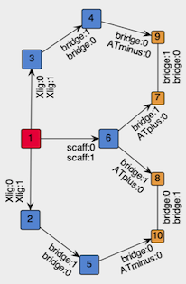
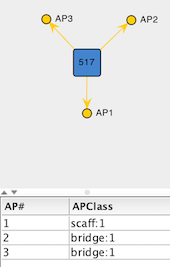
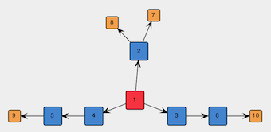

# Tutorial 3.0: Evolutionary Design of &kappa;<sup>3</sup>-Chelator for Pt(CO)

## Introduction
Multidentate ligands play a critical role in transition-metal chemistry. Therefore, this exercise is dedicated to the design of rings that involve a metal center and a tuneable, chelating organic ligand.

Like in the [previous exercise](tutorial_2.0.md) we set as chemical goal the elongation of the CO bond on Pt(II) complexes. This time, however, we explore tridentate ligands that adhere to the previous [X, L, X] pattern so that the L site is *trans* to the carbonyl ligand (CO) and the two X sites are both *cis* to CO and *trans* to each other.

To define such constrain, while allowing DENOPTIM to change the components forming the ring, we make use of a special type of vertex called **Template**. Templates are vertices that can embed graphs and can define constraints on such embedded graphs. Also, while the embedded graph may be editable, the Template appears as a single vertex, when seen from the outside.


**Figure 1**: A template vertex contains an embedded graph (bottom), but is seen as a single vertex in the graph that owns the template vertex (top).

Compared to the design of monodentate ligands, the design of multidentates, as the design of rings in general, poses an additional challenge: the closability of a chain cannot be given for granted unless the chain elements are constrained to include only known rings. Even then, substituents on the chain may prevent the actual formation of the ring by adding steric hindrance, or by adding additional constraints (e.g., fused rings). Since in de novo design we typically want to explore unknown structural features, we aim i) to avoid assumptions on the closability and ii) to assess closability on the fly. In this example, we use a hybrid approach in that only rings with a certain size (i.e., atom count) are allowed to form, but their closability is evaluated only in the molecular modeling workflow by a dedicated ring-closing conformational search (further details at [*J. Chem. Inf. Model.* **2015**, 55, 9, 1844–1856](https://doi.org/10.1021/acs.jcim.5b00424)).

(RCVs)=
Within DENOPTIM's graph representation rings are created involving a pairs of special vertexes (orange in Figure 1): the so-called *ring-closing vertexes*, or RCVs. The RCVs have two roles: First, they represent the possibility to form a chord which is created only when a pair of RCVs commits to this purpose. Second, they contain dummy atoms (i.e., the *ring closing attractors*) that are used in the ring-closing conformational search to fold open chains into a ring-closing conformation. Such conformation brings the head and tail of an open chain in relative positions that allow formation of a bond between them, thus closing the open chain into a ring (see [*J. Chem. Inf. Model.* **2015**, 55, 9, 1844–1856](https://doi.org/10.1021/acs.jcim.5b00424)).

Again, to save time, we will use a list of pre-computed molecules that has been processed via the ring-closing conformational search and geometry optimisation workflow as to compute the fitness value (i.e., the length of the C&equiv;O bond). Therefore, the ring-closing conformational search, as well as actual molecular modeling task, will not take place during this tutorial.


## Instructions

### Creation of a Template Vertex
To create the Template vertex for our tridentate skeleton, we build the graph that will be embedded in the template and then we wrap-it into a vertex. The graph to embed should contain the metal center (red in Figure 2) and place-holding vertexes for the components of the chelation system: the coordinating sites, and the bridges (both blue in Figure 2). In addition, to require formation of the rings, we include in the template two pairs of *ring-closing vertexes* (orange in Figure 2).

  

  **Figure 2**: Structure of the graph to be embedded in the template vertex.

If you are impatient, you can skip all the creation of the template and [jump directly to its deployment](shortcut-skipp-templ-creation).


1. Start DENOPTIM from within the `tutorial_3.0` folder. This is done from the Terminal (macOS/Linux) or the Anaconda prompt (Windows):
  ```
  cd your_path_to_tutorial_3.0
  denoptim
  ```

2. Choose the shortcut to `Make Graphs` or `File`->`New`->`New Graphs` to open the graph editor.

3. Since we are going to build a graph that is meant for a specific space of building blocks, we load such space to make the building blocks available. Click on the `Load BBSpace` button on the right-hand part of the editor. Choose `Use parameters from an existing file` and browse to load file `monodentate_BBSpace.par`, which is contained in the `tutorial_3.0` folder. Once the parameters imported from the file are displayed, click on `Create BB Space`.

4. Start the construction of a new graph by clicking on `Add` button on the top-right. Chose to `Build` a graph starting from a building block of type `Scaffold`. There is only one such vertex, and is the Pt-CO fragment we have already used in the previous exercise. Select that vertex to use it as the seed of our graph.

<div style="background-color: #e7f3fe; border-left: 6px solid #2196F3; margin-bottom: 15px; padding: 4px 12px;"><b>NOTE:</b> Remember what learned in the Tutorial 1.1. DENOPTIM's graph representation have no dimensionality. Therefore, the relative placement of vertexes and attachment points is completely irrelevant. You can drag any component of the graph to help visualisation. Yet, such changes affect only on the graphical depiction and have no effect on the graph representation itself. Moreover you can right-click and `Refine node locations` to improve the bi-dimensional placements of nodes.</div>

5. In the graph view, click on the yellow point that represent the attachment point corresponding to the coordination site *trans* to CO. This selects the attachment point on which we want to append a vertex.

6. Click on the button `Add Empty Vertex` to add a placeholder for the L-type site of the ligand. This opens a dialog that allows creation of a new vertex by defining the list of attachment points. In this case, add three attachment points via the `Add AP` button: one with APClass `scaff:1` (this APClass is not present in the list, so it will have to be created on the fly) and two with APClass `bridge:1`.

<div style="background-color: #e7f3fe; border-left: 6px solid #2196F3; margin-bottom: 15px; padding: 4px 12px;"><b>NOTE:</b> En <b>Empty Vertex</b> is yet another type of vertex that contains no chemical object, but can have attachment points. Empty vertexes are typically used as placeholders or masks defining that pattern of attachment points are expected by any non-empty vertex occupying the place held by the empty vertex.</div>

7. Make sure the drop-down menu located below the list of attachment points selects `FRAGMENT` as type of building block, and click `Create`. The result should be similar to the figure below.

  

  **Figure 3**: Empty Vertex created to represent the L-type site on the tridentate ligand template.

8. In the list of attachment points, click on the row with APClass `scaff:1` to specify that this attachment point should be the one used to append the empty vertex onto the attachment point that was initially selected on the graph. Clicking on `Confirm selected AP` triggers the addition of the vertex to the graph and the formation of the corresponding edge.

9. The procedure for appending a single empty vertex can now be repeated on the other two APs on the Pt-CO vertex, those with `Xlig:0` APClass. Since these two parts of the graph are equivalent in Figure 2, you can select both APs and append a copy of the created empty vertex on each of them. Do this twice:
  - first, to add an empty vertex with APs `Xlig:1` and `bridge:1` (Select the AP `Xlig:1` as AP to bind the empty verted onto the growing graph),
  - then, to append an empty vertex with **two** APs `bridge:0`.

10. To add RCVs (orange in Figure 2), instead, we use vertices saved in the space of building blocks. To this end, select the two APs on the first empty vertex you have added (i.e., the one representing the L-type site), click `Add Vertex from BB Space` and chose `Any Vertex`. Choose the second-last vertex, i.e., the one with a single AP of class `ATplus:0`, and append them to the graph.

11. Repeat for the two last attachment points, but this time choose the very last vertex, i.e., the one with a single AP of class `ATminus:0`. The result should be similar to the following picture:

  

  **Figure 4**: Spanning tree of the graph to be embedded in the template.

12. The above graph is symmetric but there is nothing preventing place-holder vertexes such as 3 and 4 in Figure 4 (NB: the vertex identifiers may differ in your graph) to be replaced by different molecular fragments, thus leading to an asymmetric graph. One may be interested in both symmetric and asymmetric graphs, but in this tutorial we want only symmetric graphs. Therefore, we select sets of vertexes that are supposed to be symmetric (e.g., in Figure 4, the two sets [3, 4] and [5, 6]) and click on `Set as Symmetric`.

  <div style="background-color: #e7f3fe; border-left: 6px solid #2196F3; margin-bottom: 15px; padding: 4px 12px;"><b>NOTE:</b>  after selecting a vertex, do shift-click on another vertex to expand the selection.</div>

  <div style="background-color: #e7f3fe; border-left: 6px solid #2196F3; margin-bottom: 15px; padding: 4px 12px;"><b>NOTE:</b>  Symmetry constraints are not visible in the graphical representation of a graph. Therefore, no apparent change results from clicking on `Set as Symmetric`.</div>

  <div style="background-color: #ffffcc; border-left: 6px solid #ffeb3b; margin-bottom: 15px; padding: 4px 12px;"><b>Discussion Point:</b> what is the effect of symmetric constrains on the number of candidate graphs that can be built from the graph in Figure 4?</div>

13. The graph in Figure 4 is still acyclic, so we add the chords between the appropriate pairs of RCVs by selecting a pair and clicking on `Add Chord`.

14. The graph is now complete. Drag-click to select all vertexes, right-click and choose `Show APClasses`. Verify the result by comparison with Figure 2. Click on `Save changes` and look at eh content on the molecular representation in the bottom-left part of the screen. The system contains only the atoms from the Pt-CO fragment and the dummy atoms coming from the RCVs, which are places in random places.

15. So far, the graph is special only in the fact that it contains empty vertexes. More importantly, it is not yet embedded in a template. To enclose the graph in a template, click on `Save Library of Templates` and choose *Contract:*`FIXED_STRUCT` and *Type*: `SCAFFOLD`. Save as `lib_scaffolds_my_template.sdf` under the `tutorial_3.0` folder.


(shortcut-skipp-templ-creation)=
### Evolutionary Design with Templates
We are now going to use the template vertex we have just created to design our symmetric and chelating ligands for Pt-CO complexes.

1. From within the `tutorial_3.0` folder, open the file of parameters
  ```
  denoptim input_parameters
  ```
  and inspect the parameters. This file assumes you have created the `lib_scaffolds_my_template.sdf` file in the previous part of the exercise.

  <div style="background-color: #e7f3fe; border-left: 6px solid #2196F3; margin-bottom: 15px; padding: 4px 12px;"><b>NOTE:</b> if you are in a hurry, you'll find a pre-built template in <code>lib_scaffolds_w_chelation_template.sdf</code>. You can rename this file to <code>lib_scaffolds_my_template.sdf</code> to skip all the first part of this tutorial.</div>

2. Run the evolutionary design by clicking on `Run Now...`.

  <div style="background-color: #e7f3fe; border-left: 6px solid #2196F3; margin-bottom: 15px; padding: 4px 12px;"><b>NOTE:</b> all types of experiments can be started both from the GUI and from command line. This experiment can be started in a terminal from within the <code>tutorial_3.0</code> using this command:
  <p><code>denoptim -r GA input_parameters</code></p>
  See also <code>denoptim --help</code> for further details.</div>

3. Once the experiment is finished, open the output with `File`->`Open Recent...` and inspect the results.

  <div style="background-color: #e7f3fe; border-left: 6px solid #2196F3; margin-bottom: 15px; padding: 4px 12px;"><b>NOTE:</b> opening the GA inspector is also among the operations that can be done directly from the command line
  <p><code>denoptim path_to_folder_RUNYYYYMMDDHHMMSS</code></p></div>

  <div style="background-color: #ffffcc; border-left: 6px solid #ffeb3b; margin-bottom: 15px; padding: 4px 12px;"><b>Discussion Point:</b> Consider the symmetry of the generated complexes. Search for ligands that have lower symmetry than others, for example, N-heterocyclic carbenes with different sets of substituents on the carbon atoms of their backbone. Is the graph representation symmetric? Motivate your answer reflecting on <a href="https://htmlpreview.github.io/?https://github.com/denoptim-project/DENOPTIM/blob/master/doc/user_manual.html#Toc43999_808352928">DENOPTIM's definition of symmetric attachment points</a>.
